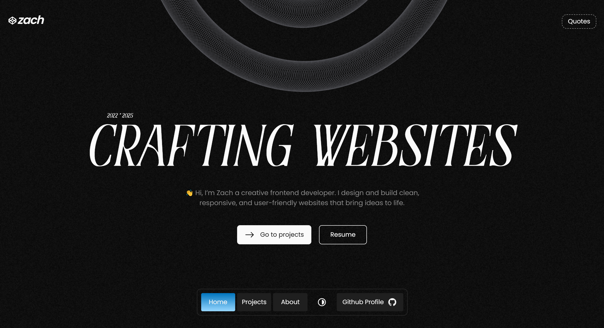

# Zach | Personal Portfolio

Welcome to my personal portfolio repository.  
Here, you'll find a collection of projects that demonstrate my skills in modern web development using **React**, **Tailwind CSS**, **JavaScript**, **HTML5**, and **CSS3**.

## 🚀 About This Portfolio

This portfolio website showcases my ability to build responsive, user-friendly web applications with clean, maintainable code. It highlights:

- Fast and modern React components using hooks
- Tailwind CSS for rapid and consistent styling  
- Semantic HTML and accessible UI design  
- JavaScript functionality and interactivity  

## 🖥️ Homepage Preview

---

## 📂 Projects

Explore individual project folders for detailed descriptions, live demos, and source code.

## 📫 Connect With Me

- Portfolio Website: [https://zach-portfolio-sigma.vercel.app/](https://zach-portfolio-sigma.vercel.app/)
- LinkedIn: [https://www.linkedin.com/in/dawn-izach-cruz-a5b405367/](https://www.linkedin.com/in/dawn-izach-cruz-a5b405367/)
- Email: cruzdawn58@gmail.com

---

Thank you for visiting! Feel free to reach out or contribute.
